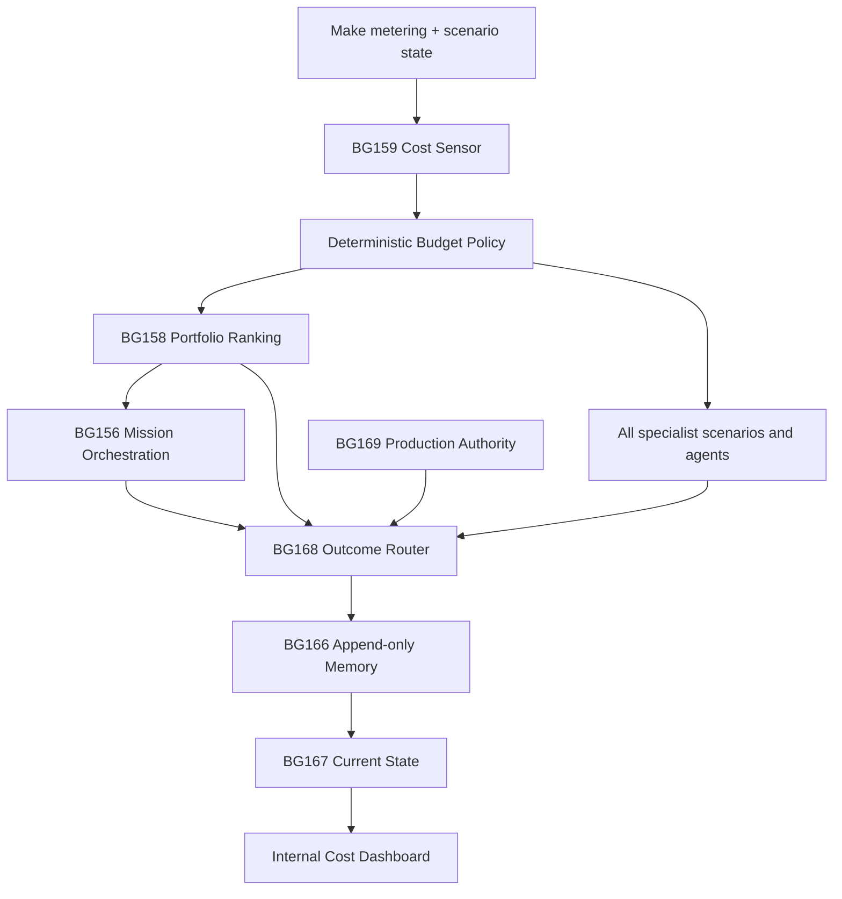

# Make Cost Control + Internal Brain Dashboard Design — 2026-08-30

## Status

Approved direction; implementation requires this specification to be reviewed before the implementation plan is written.

## Goal

Keep the complete Bedrijfsgeheugen Powerhouse — Make scenarios, agents, shared memory, production governance and specialist cortices — within a hard user budget of **10,000 Make credits per calendar month**, without silently dropping production outcomes, security checks, data-integrity obligations or human-send safeguards.

The cost dashboard is not a separate reporting island. It is the read-only human view of the same shared Brain truth used by the scenarios and agents.

## Evidence baseline

Fresh Make metering on 2026-08-30 showed:

- period total: 142,986.95 credits, 69,428 operations and 3.216 GB transfer;
- day delta: 4,113.45 credits, 2,719 operations and 24.05 MB transfer;
- a 10,000-credit month permits approximately 322.58 credits/day in a 31-day month;
- the observed daily burn was approximately 12.8 times the sustainable daily envelope;
- known control-plane consumers include BG159, BG162, BG166, BG167 and BG168;
- known hotspots include BG139, BG156, BG185 and repeated shared-memory refresh cycles;
- prior bounded optimizations proved that data transfer and operations can be reduced materially without changing business logic.

The monthly limit is treated as a hard product invariant, not a suggestion.

## Non-goals and immutable boundaries

This change does not automatically alter:

- sales or marketing decision rules;
- persuasion strategy;
- exact LinkedIn targeting;
- DM completeness or human-send safety;
- Interaction Datahub contracts;
- secrets, credentials, permissions or paid plan limits;
- destructive or irreversible data;
- production/security/data-integrity protected metrics.

No scenario is declared green merely because a technical run succeeded. Outcome obligations remain binding.

## One Brain architecture

### Shared-truth flow

### Responsibilities

- **BG159 — Cost Sensor and Ledger Owner:** fetches one complete team-level scenario inventory, calculates total and delta metrics per scenario, classifies agent/control-plane/business workloads and writes only changed cost state.
- **Deterministic Budget Policy:** calculates the allowed pace, remaining credits, forecast and action class. It performs no model call.
- **BG158 — Shadow Portfolio Controller:** ranks only material candidate work within the remaining budget. Hard security, production and data-integrity interrupts precede scoring.
- **BG156 — Closed-loop Orchestrator:** runs the full multi-agent chain only for P0/ambiguous work that cannot be resolved by a cheaper deterministic or specialist path.
- **BG166/BG167/BG168:** remain the shared Event Memory, Current State Projection and Outcome Router. Cost decisions, deferrals, recoveries and verified savings are routed through the same memory.
- **BG169:** remains the sole production authority. Budget pressure cannot bypass production gates.
- **Specialist scenarios and agents:** read the same budget state before optional work and return a typed result: `RUN`, `CHEAP_PATH`, `CACHE_HIT`, `BUDGET_DEFERRED`, `PROTECTED_INTERRUPT` or `BLOCKED_HARD_BOUNDARY`.
- **Internal dashboard:** reads the sanitized BG167/BG159 projection. It never becomes a second source of truth and never writes decisions directly to Make.

## Cost accounting model

Each scenario-day record contains:

- `date`, `scenario_id`, `scenario_name`, `scenario_class`;
- `credits_total`, `credits_delta`;
- `operations_total`, `operations_delta`;
- `data_transfer_total`, `data_transfer_delta`;
- `execution_count`, `avg_credits_per_execution`;
- `monthly_budget`, `allocated_budget`, `remaining_budget`;
- `pace_allowance_today`, `forecast_month_end`;
- `budget_state`, `recommended_action`, `autonomy_class`;
- `freshness`, `quality`, `source_hash`, `fingerprint`;
- `trace_id`, `correlation_id`, `parent_event_id`;
- protected metrics and outcome-obligation status.

Only aggregate operational metrics are stored. Prompt bodies, DM content, CRM personal data, access tokens and secrets are excluded.

## Budget policy

### Dynamic daily allowance

The controller uses:

`daily_allowance = remaining_monthly_credits / remaining_calendar_days`

It also calculates a seven-day smoothed burn rate to avoid overreacting to a single necessary production event.

### Monthly allocation

| Work class | Monthly credits | Purpose |
|---|---:|---|
| Production and core outcomes | 4,500 | Required delivery, reconciliation and production safety |
| Publishing and data sync | 2,000 | Due content and required system synchronization |
| Commercial obligations | 1,500 | CRM/DM work with measurable business value |
| Shared memory and control plane | 800 | BG159/BG166/BG167/BG168 and essential governance |
| Research and creative experiments | 700 | Delta-only, evidence-gated optional work |
| Emergency reserve | 500 | Security, rollback and urgent recovery |
| **Total** | **10,000** | Hard monthly ceiling |

Unused class budget may flow to a higher-priority protected class, never the other way around. The reserve is released only by a protected interrupt.

### Budget states

| State | Pace usage | Allowed behavior |
|---|---:|---|
| Green | <70% | Normal bounded work; deterministic/cache-first |
| Orange | 70–90% | Delta-only retrieval, one specialist, smaller context |
| Red | 90–100% | Production, security, data integrity and due obligations only |
| Exhausted | >=100% | Optional work becomes `BUDGET_DEFERRED`; protected interrupts use reserve |

A deferred outcome is persisted with owner, reason, earliest retry date and evidence. It is never silently lost.

## Scenario-by-scenario management

BG159 owns a single inventory snapshot per day rather than every agent independently polling Make. Cheap delta checks may run during the day only when a material trigger occurs.

The controller assigns each scenario:

1. a functional class;
2. a monthly and daily soft allocation;
3. an observed average credits/run;
4. an allowed trigger frequency;
5. a cache/dedupe policy;
6. a maximum retry policy;
7. a fallback or defer policy;
8. protected outcomes that may not be sacrificed;
9. an owner and next safe action.

### First optimization wave

- **BG162:** atomic idempotency and duplicate-event suppression before downstream dispatch.
- **BG166/BG167:** coalesced, material-only refresh windows; no refresh for an unchanged fingerprint.
- **BG159:** one full daily inventory; no broad per-scenario execution/blueprint enrichment unless a delta or error crosses a threshold.
- **BG156:** full orchestration only for P0 or genuinely ambiguous work; otherwise route directly to the smallest specialist.
- **BG185:** cached blueprint hashes, one audit per changed blueprint and same-window duplicate blocking.
- **BG139:** preserve the proven lean path; do not cut over to BG190 until exact output equivalence is proven on at least 25 representative calls and BG191 remains green.
- **AI/prompt agents:** deterministic validation, existing outcome reuse, delta retrieval and small context before any new model request.
- **Retries:** maximum two identical attempts per hypothesis; then change hypothesis, use last-known-good or defer safely.

## Internal HTML dashboard

### Route

The dashboard is delivered on a non-public internal path, initially:

`/intern/powerhouse-kosten/`

A dedicated internal hostname may later map to the same protected application, but DNS or domain permission changes are outside autonomous scope. The route is absent from public navigation, sitemap and search feeds.

### Views

1. **Budget now:** monthly limit, used, remaining, daily pace, forecast and reserve.
2. **All scenarios:** sortable table with daily/monthly credits, operations, transfer, executions, forecast, class, status and next action.
3. **Agents vs non-agents:** cost split and trend.
4. **Top consumers:** current day, rolling seven days and month.
5. **Waste signals:** duplicate runs, retries, unchanged refreshes, stale workers and high transfer.
6. **Savings register:** verified before/after deltas, regressions, KEEP/ROLLBACK result and linked Brain event.
7. **Deferred work:** explicit `BUDGET_DEFERRED` obligations and earliest safe retry.
8. **Freshness and integrity:** last BG159 sample, last BG167 projection, contract version and data-quality warnings.

The dashboard is read-only. Operational action remains in the governed Brain flow.

## Security design

Security is fail-closed and layered.

### Authentication and authorization

- Use `@netlify/identity`; do not use the deprecated Identity widget or GoTrue client.
- Netlify Identity registration is **Invite only**.
- Access requires a server-controlled `app_metadata.roles` role: `powerhouse-cost-admin`.
- Authentication is checked server-side before any HTML data or API response is returned.
- The protected data function independently calls `getUser()` and returns 401 for no user and 403 for a missing role.
- The current Basic Auth edge lock remains in place until the Identity-based candidate is proven green; it is not removed before equivalent or stronger protection is verified.
- No authorization decision trusts `user_metadata` or a client-side flag.

### Data and secret isolation

- Make and Notion credentials remain server-side environment variables only.
- The browser receives a sanitized aggregate schema; no prompts, CRM/DM data, personal identifiers, blueprint bodies or credential values.
- The dashboard cannot call the Make API directly.
- The dashboard API is same-origin, GET-only and read-only.
- Any future ingest endpoint requires signed, replay-resistant requests, strict schema validation, timestamp tolerance and idempotency. It is not exposed until its credential boundary is explicitly authorized.

### Browser and HTTP controls

Protected HTML and API responses set:

- `Cache-Control: private, no-store`;
- `X-Robots-Tag: noindex, nofollow, noarchive`;
- `Content-Security-Policy` with `default-src 'self'`, no third-party scripts, `frame-ancestors 'none'`, restricted `connect-src` and no inline script unless hash/nonce protected;
- `X-Frame-Options: DENY`;
- `X-Content-Type-Options: nosniff`;
- `Referrer-Policy: no-referrer`;
- a restrictive `Permissions-Policy`;
- HSTS through the production HTTPS host.

No service worker or shared browser cache stores dashboard responses.

### Threat cases and required behavior

| Threat | Required result |
|---|---|
| Anonymous request | 401 before sensitive content |
| Authenticated user without role | 403 |
| Direct API URL guessing | Same 401/403 checks |
| Stolen public HTML/JS | Contains no operational data or secret |
| XSS payload in scenario name | Rendered as text; CSP blocks execution |
| Clickjacking | DENY / `frame-ancestors 'none'` |
| Search crawler | No index, no sitemap entry, authorization required |
| Replay/duplicate ingest | Signature, timestamp and idempotency rejection |
| Missing auth configuration | Fail closed |
| Budget controller failure | Last-known-good budget state; optional work deferred |

This design reduces attack surface; it cannot honestly promise that any internet-connected system is impossible to hack. The acceptance standard is defense in depth, least privilege, no browser secrets, explicit tests and fail-closed behavior.

## Shared-memory event contract

Every material budget decision and verified change is written through BG168 with:

- `schema_version: brain.v1`;
- `type: SIGNAL | OPPORTUNITY | DECISION | MISSION | OUTCOME | PATTERN`;
- `trace_id`, `correlation_id`, `fingerprint`, parent lineage;
- confidence and evidence references;
- before/after cost, latency, operations and data transfer;
- protected metrics;
- budget class and allocation;
- regression test and KEEP/ROLLBACK result.

BG167 must expose the newest accepted event in Current State before the dashboard labels it current. Stale or contradictory samples are visibly downgraded or quarantined.

## Rollout

### Phase 0 — Baseline and contracts

- Freeze the verified scenario inventory and one-day/rolling-seven-day baseline.
- Add machine-readable 10,000-credit policy and per-class allocation.
- Add obligations for ledger completeness, budget enforcement and dashboard access control.

### Phase 1 — Shadow accounting

- Run BG159 vNext once daily.
- Calculate per-scenario deltas and recommendations without blocking work.
- Compare totals with Make's native meter; tolerance must be explicit and small.
- Do not use model calls to calculate budget state.

### Phase 2 — Safe cost reductions

- Enable dedupe/coalescing/cache changes one component at a time.
- Run exact outcome and protected-metric regression tests.
- Record before/after and keep only verified improvements.
- Immediately block proven same-window duplicate storms because this is a reversible A1 safety control.

### Phase 3 — Budget enforcement

- Enforce Green/Orange/Red/Exhausted behavior for optional work.
- Preserve protected interrupts and outcome obligations.
- Route every deferral into shared memory with a recovery date.

### Phase 4 — Internal dashboard

- Deploy the authenticated dashboard to a preview URL.
- Complete auth, role, header, XSS and no-secret tests.
- Verify exact preview commit and sanitized schema.
- Pass BG169 production gate and promote only when all protected tests are green.

## Verification and regression gates

### Cost and behavior

- Monthly limit and dynamic daily allowance are deterministic and timezone-safe.
- Scenario deltas reconcile to Make totals within defined tolerance.
- Unchanged fingerprints produce no duplicate event or refresh.
- Optional work is deferred at budget exhaustion.
- Production/security/data-integrity obligations remain runnable.
- No sales, persuasion, human-send or Datahub contract changes.
- Before/after savings use comparable windows and include execution counts.

### Security

- 401 anonymous test for dashboard and API.
- 403 wrong-role test.
- 200 correct-role test with sanitized fields only.
- Missing Identity configuration fails closed.
- Static asset scan finds no token, secret or operational payload.
- CSP/XSS test with hostile scenario names.
- Clickjacking, no-store and noindex header tests.
- No public sitemap/navigation reference.
- Dependency and secret scans remain green.

### Release

- Exact preview SHA and artifact verified.
- Existing accepted website baseline and navigation tests remain green.
- Production deploy exact SHA verified.
- Production authenticated smoke and unauthorized denial both pass.
- Rollback target is the prior exact last-known-good deploy.
- BG168 writeback and BG167 visibility are verified.

## Outcome obligations

The implementation creates at least these obligations:

- `cost-policy-10000-monthly`: budget state is correct and enforced for all optional work.
- `cost-ledger-all-scenarios-daily`: every current Make scenario appears exactly once in the daily ledger.
- `brain-budget-writeback`: material decisions are visible through BG168/BG167.
- `internal-dashboard-authz`: unauthorized users cannot retrieve HTML data or API data.
- `internal-dashboard-freshness`: displayed state is within the accepted freshness window or visibly marked stale.
- `production-promotion-dashboard`: exact production SHA and access-control smoke are verified by BG169.

## Definition of done

This work is complete only when:

- all Make scenarios and agents have a budget class and measurable daily delta;
- the projected monthly burn is at or below 10,000 credits under representative operation, or remaining protected overage is explicitly evidenced and surfaced;
- optional work is budget-governed without silent loss;
- the dashboard is reachable only by invited users with the server-controlled role;
- no secret or personal/business content is shipped to the browser;
- dashboard and budget decisions use the same BG159/BG167 shared truth;
- before/after savings and regressions are recorded through BG168;
- exact preview and production commits are verified;
- protected outcomes remain green;
- rollback to last-known-good is tested and documented.
